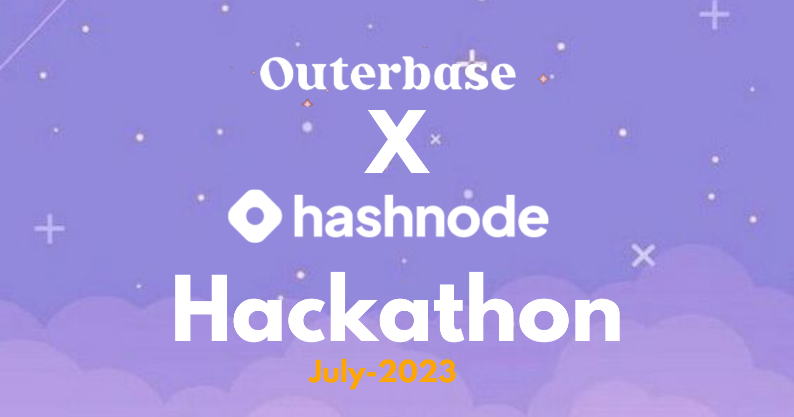

#  Outerbase Hackathon (Outerbase X Hashnode) — September 2023
  


### Project Task

**To Build an exciting Open-Source app of your choice using Outerbase as Database or create Plugins for Outerbase and its other features during the whole of September . Publish an article on your Hashnode blog about the process of creating and launching your app for a chance to win one of the 5 cash prizes and swags!**

[Live Demo URL](https://ryform.vercel.app)


### Project Overview

It consits of :

* Header
* Light/Dark Mode
* Hero Section
* Create Forms
* Form Link Page
* Dashboard Page
* Form Submission Data
* Footer
and many more....

and many more components...

### Tech Stack Used

- Next.js (Fullstack Framework for React.js)
- React.js (Front-end UI Library)
- Tailwind CSS (CSS Framework)
- Outerbase (ForDatabase and) with Postgres Database
- Vercel (For Hosting the App)

### UI Resources Used

* Images - (Google Images)
* SVG Icons - (Lucide Icons)
* Fonts (Inter)- (Google fonts)


### The Code

Steps to run the app locally:


#### Step-1: Git Clone the project

```bash
   git clone https://github.com/raiv200/Ryform.git
```

#### Step-2: Install the dependencies

```bash
  npm install
```

#### Step-3: Add the Environment Variables in the (.env ) File

 Create a .env file in **root of the directory** and add the following environment variables.

```bash

NEXT_PUBLIC_SUPABASE_URL=
NEXT_PUBLIC_SUPABASE_ANON_KEY=
SUPABASE_DB_PASSWORD=
SUPABASE_DB_USER=
SUPABASE_DB_PORT=
SUPABASE_DB_HOST=
SUPABASE_DB_DATABASE=
SUPABASE_ACCESS_TOKEN=

```


I have used Supabase Postgres Database, so you can get the credentials from their dashboard.


#### Step-4: Start the development server

Now open your project in your favorite IDE , (VsCode) and then start the development server.

```bash
   npm run dev
```
